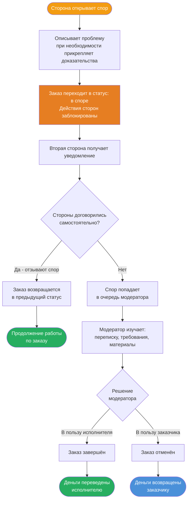

# Разрешение спора - Qvorka

```mermaid
flowchart TD
    A([Сторона открывает спор]) --> B[Описывает проблему\nпри необходимости прикрепляет доказательства]
    B --> C[Заказ переходит в статус: в споре\nДействия сторон заблокированы]
    C --> D[Вторая сторона получает уведомление]
    D --> E{Стороны договорились\nсамостоятельно?}
    E -->|Да - отзывают спор| F[Заказ возвращается\nв предыдущий статус]
    F --> G([Продолжение работы\nпо заказу])
    E -->|Нет| H[Спор попадает\nв очередь модератора]
    H --> I[Модератор изучает:\nпереписку, требования, материалы]
    I --> J{Решение\nмодератора}
    J -->|В пользу исполнителя| K[Заказ завершён]
    J -->|В пользу заказчика| L[Заказ отменён]
    K --> M([Деньги переведены\nисполнителю])
    L --> N([Деньги возвращены\nзаказчику])

    style A fill:#f39c12,color:#fff
    style M fill:#27ae60,color:#fff
    style N fill:#4a90d9,color:#fff
    style C fill:#e67e22,color:#fff
    style G fill:#27ae60,color:#fff
```
