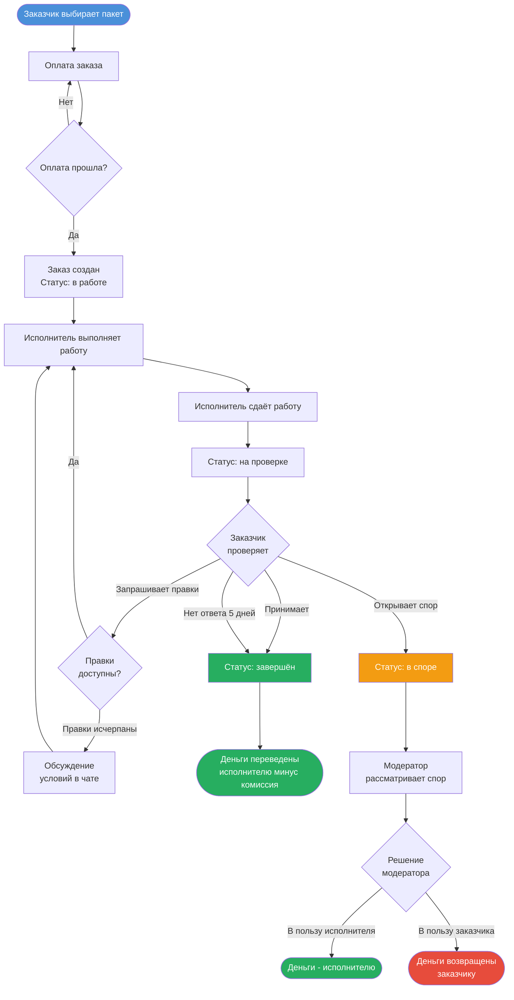

# Жизненный цикл заказа - Qvorka

```mermaid
flowchart TD
    A([Заказчик выбирает пакет]) --> B[Оплата заказа]
    B --> C{Оплата прошла?}
    C -->|Нет| B
    C -->|Да| D[Заказ создан\nСтатус: в работе]
    D --> E[Исполнитель выполняет работу]
    E --> F[Исполнитель сдаёт работу]
    F --> G[Статус: на проверке]
    G --> H{Заказчик\nпроверяет}
    H -->|Принимает| I[Статус: завершён]
    H -->|Запрашивает правки| J{Правки\nдоступны?}
    H -->|Открывает спор| K[Статус: в споре]
    H -->|Нет ответа 5 дней| I
    J -->|Да| E
    J -->|Правки исчерпаны| L[Обсуждение\nусловий в чате]
    L --> E
    I --> M([Деньги переведены\nисполнителю минус комиссия])
    K --> N[Модератор\nрассматривает спор]
    N --> O{Решение\nмодератора}
    O -->|В пользу исполнителя| P([Деньги - исполнителю])
    O -->|В пользу заказчика| Q([Деньги возвращены\nзаказчику])

    style A fill:#4a90d9,color:#fff
    style M fill:#27ae60,color:#fff
    style P fill:#27ae60,color:#fff
    style Q fill:#e74c3c,color:#fff
    style K fill:#f39c12,color:#fff
    style I fill:#27ae60,color:#fff
```
