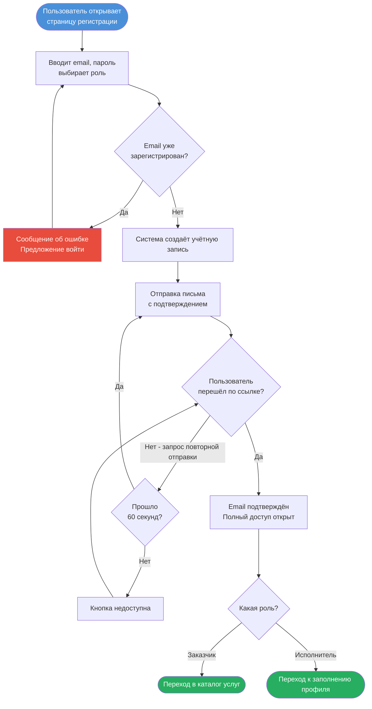

# Регистрация пользователя - Qvorka

```mermaid
flowchart TD
    A([Пользователь открывает\nстраницу регистрации]) --> B[Вводит email, пароль\nвыбирает роль]
    B --> C{Email уже\nзарегистрирован?}
    C -->|Да| D[Сообщение об ошибке\nПредложение войти]
    D --> B
    C -->|Нет| E[Система создаёт учётную запись]
    E --> F[Отправка письма\nс подтверждением]
    F --> G{Пользователь\nперешёл по ссылке?}
    G -->|Нет - запрос повторной отправки| H{Прошло\n60 секунд?}
    H -->|Нет| I[Кнопка недоступна]
    I --> G
    H -->|Да| F
    G -->|Да| J[Email подтверждён\nПолный доступ открыт]
    J --> K{Какая роль?}
    K -->|Заказчик| L([Переход в каталог услуг])
    K -->|Исполнитель| M([Переход к заполнению профиля])

    style A fill:#4a90d9,color:#fff
    style L fill:#27ae60,color:#fff
    style M fill:#27ae60,color:#fff
    style D fill:#e74c3c,color:#fff
```
