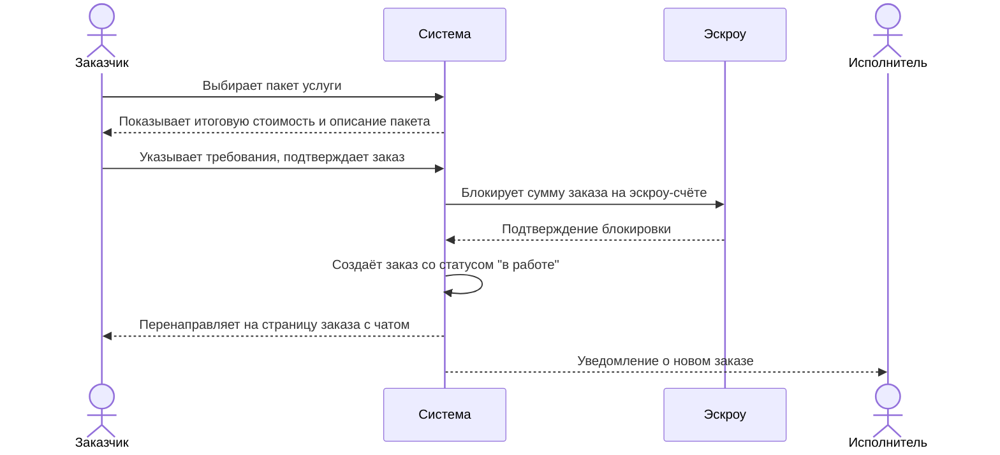

# Оформление заказа - Qvorka

```mermaid
sequenceDiagram
    actor Заказчик
    participant Система
    participant Эскроу
    actor Исполнитель

    Заказчик->>Система: Выбирает пакет услуги
    Система-->>Заказчик: Показывает итоговую стоимость и описание пакета
    Заказчик->>Система: Указывает требования, подтверждает заказ
    Система->>Эскроу: Блокирует сумму заказа на эскроу-счёте
    Эскроу-->>Система: Подтверждение блокировки
    Система->>Система: Создаёт заказ со статусом "в работе"
    Система-->>Заказчик: Перенаправляет на страницу заказа с чатом
    Система-->>Исполнитель: Уведомление о новом заказе
```
