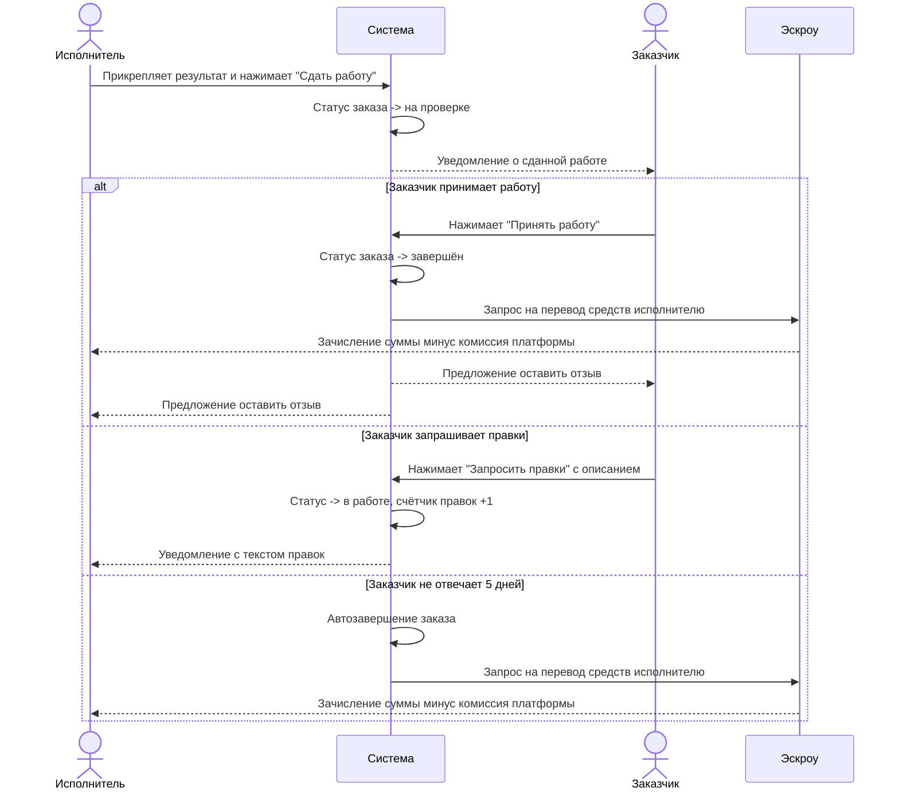

# Сдача работы и завершение заказа - Qvorka

```mermaid
sequenceDiagram
    actor Исполнитель
    participant Система
    actor Заказчик
    participant Эскроу

    Исполнитель->>Система: Прикрепляет результат и нажимает "Сдать работу"
    Система->>Система: Статус заказа -> на проверке
    Система-->>Заказчик: Уведомление о сданной работе

    alt Заказчик принимает работу
        Заказчик->>Система: Нажимает "Принять работу"
        Система->>Система: Статус заказа -> завершён
        Система->>Эскроу: Запрос на перевод средств исполнителю
        Эскроу-->>Исполнитель: Зачисление суммы минус комиссия платформы
        Система-->>Заказчик: Предложение оставить отзыв
        Система-->>Исполнитель: Предложение оставить отзыв
    else Заказчик запрашивает правки
        Заказчик->>Система: Нажимает "Запросить правки" с описанием
        Система->>Система: Статус -> в работе, счётчик правок +1
        Система-->>Исполнитель: Уведомление с текстом правок
    else Заказчик не отвечает 5 дней
        Система->>Система: Автозавершение заказа
        Система->>Эскроу: Запрос на перевод средств исполнителю
        Эскроу-->>Исполнитель: Зачисление суммы минус комиссия платформы
    end
```
